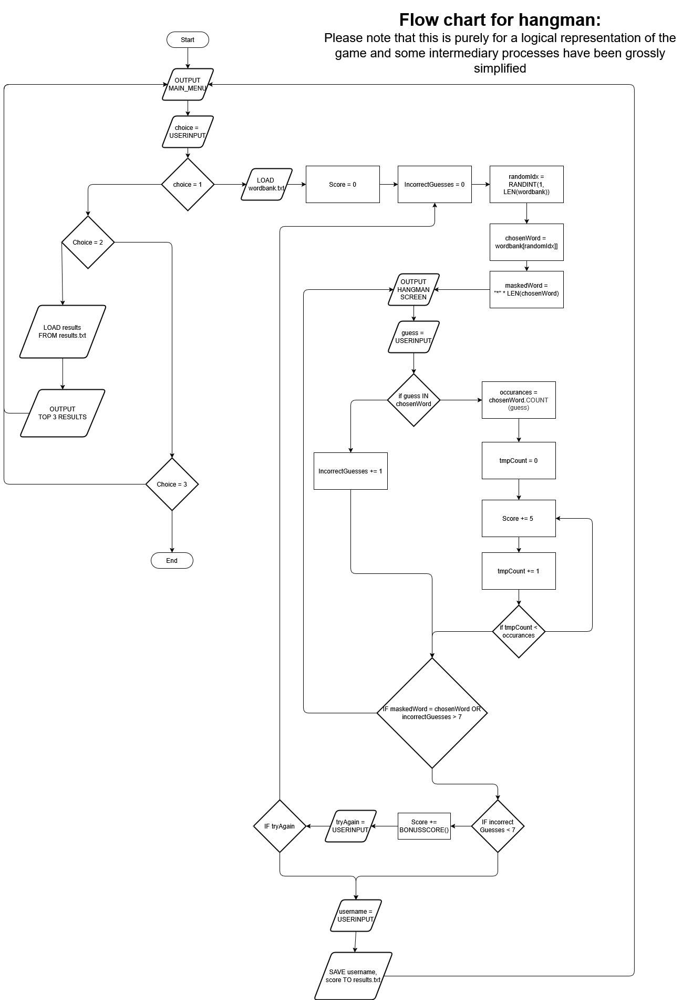

# HANGMAN
Guess the letters and then the word for a simple game of hangman,
keep going until you fail to rack up a ton of score and compete for a highscore!

Credits for:
- The wordbank: https://github.com/first20hours/google-10000-english
- the hangman ascii: https://gist.github.com/chrishorton/8510732aa9a80a03c829b09f12e20d9c

## Flowchart



## Usage
How to run the game:
- If you want to run the game simply run: This command runs with the provided WORDBANK.txt <br>
```shell
python main.py
``` 
- for a custom wordbank simply add the optional `-f` flag where `custom_wordbank.txt` would be your custom file
```shell
python main.py -f custom_wordbank.txt
```

## Rules
- Each turn, the player must either guess a letter or the word.
- For each letter occurance correct score will be awarded.
- If the letter is not in the word, the number of incorrect guesses increases and thus the drawing of the hangman progresses.
- If the number of incorrect guesses exceeds 7 (when the drawing is complete) the game is over and the player will be asked to record their score.
- If the word is successfully built from letters or the full word is guessed prior then a bonus score is awarded for getting the word correct.
- After bonus score is collected, the player can continue to allow for further points gain until they fail a word.

### Scoring
- +5 per letter occurance in the word (i.e. for the word lychee, the letter e would give a score of 10).
- A bonus score given by:
$$
    BONUSSCORE = \Bigl\lfloor \frac{100}{1+e^{(0.2(NoOfGuess - 13))}} \Bigr\rfloor
$$